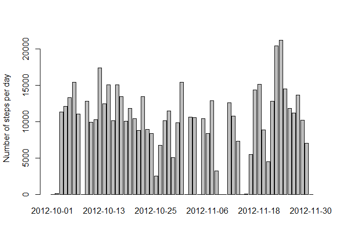
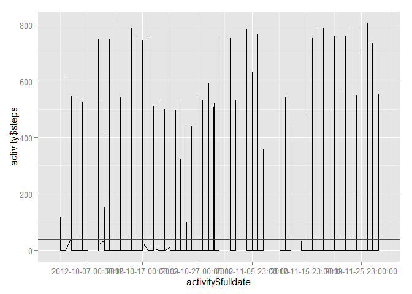
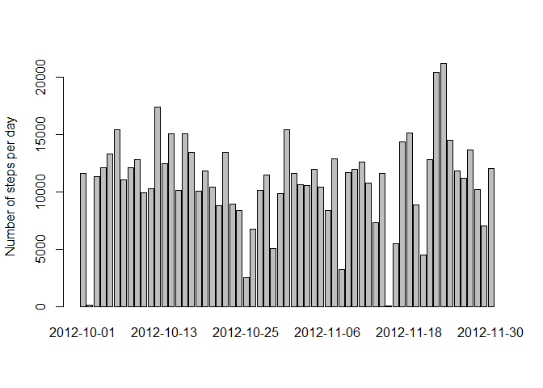
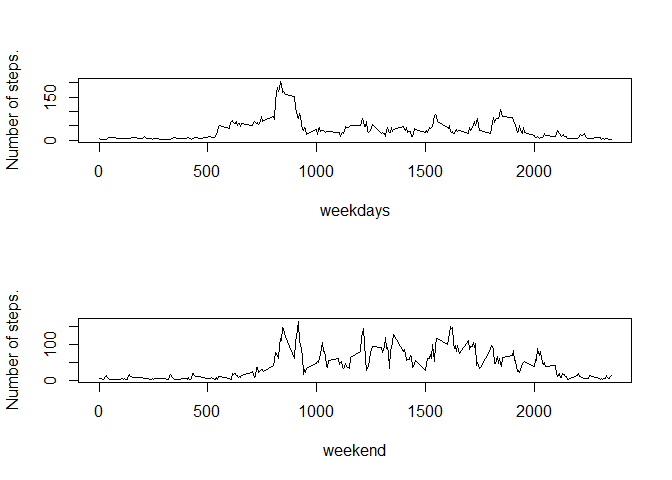

# Reproducible Research: Peer Assessment 1

 
## Loading and preprocessing the data
Extract the activity.cvs file from activity.zip,  
created data.frame from the csv file and wrap the data frame into a data table

```r
options(scipen = 1, digits = 2)
library(data.table)
library(dplyr)
activity <- data.table(read.csv(unz("activity.zip","activity.csv"))) %>%
            mutate(fulldate = strptime(date, format="%Y-%m-%d") + (interval %/% 100) * 60 + interval %% 100)  
```

## What is mean total number of steps taken per day?
Group the data by day, and summerize the steps by date. 
For dates that do not have steps, the number of steps is set to zero

```r
library(xtable)
number.of.steps.by.day <- activity %>% 
                          group_by(date) %>% 
                          summarise_each(funs(sum(., na.rm = TRUE)), steps)
```

In the historgram the number of steps per day are show  

```r
barplot( number.of.steps.by.day$steps, names.arg=number.of.steps.by.day$date, ylab="Number of steps per day")
```

 


```r
mean.steps <- mean(number.of.steps.by.day$steps)
median.steps <- median(number.of.steps.by.day$steps)
```
The mean number of step per day is 9354.23 steps per day.  
The median is 10395 steps per day.


## What is the average daily activity pattern?

```r
library(ggplot2)
library(scales)
mean.steps <- mean(activity$steps, na.rm = TRUE)
p <- qplot(activity$fulldate, activity$steps, geom="line") +scale_x_datetime(breaks = date_breaks("10 days"))
p <- p + geom_abline(intercept = mean.steps, slope = 0, colour ="red")
print(p)
```

```
## Warning in loop_apply(n, do.ply): Removed 576 rows containing missing
## values (geom_path).
```

 

## Imputing missing values

Missing values are imputed by setting that interval with the mean value of that interval over all days.  

```r
# Get the missing value count
activity <- mutate(activity, missing = is.na(activity$steps) )
missing.values.count <- sum(activity$missing)
# Calculate the mean of each interval 
intervaltable <- activity %>% 
                 group_by(interval) %>% 
                 summarise_each(funs(mean(., na.rm = TRUE)), steps)

# Imputed the values into the activity data
getImputedValue <- function(s)  { filter(intervaltable, interval=s)$steps }
activity.imputed <- mutate(activity, steps = ifelse(missing, getImputedValue(interval) ,steps))
```
The number of missing values is 2304


```r
number.of.steps.by.day.imputed <- activity.imputed %>% 
                          group_by(date) %>% 
                          summarise_each(funs(sum(., na.rm = TRUE)), steps)
```

In the historgram the number of steps per day with imputed data are show  

```r
barplot( number.of.steps.by.day.imputed$steps, names.arg=number.of.steps.by.day.imputed$date, ylab="Number of steps per day")
```

 


```r
mean.steps.imputed <- mean(number.of.steps.by.day.imputed$steps)
median.steps.imputed <- median(number.of.steps.by.day.imputed$steps)
```
The mean number of step per day with imputed data is 10905.62 steps per day.  
The median with imoputed data is11458 steps per day.

The mean number of step per day without imputed data is 37.38 steps per day  
and the median without imputed data is 10395 steps per day.  
So the impackt on the result is big.


## Are there differences in activity patterns between weekdays and weekends?

```r
# library(lattice) 
activity.imputed <- activity.imputed %>%
                      mutate(daytype = weekdays(fulldate) %in% c("Saturday", "Sunday")) %>%
                      mutate(daytype = factor(daytype ,labels= c("weekday", "weekend")))

#
activity.imputed.weekdays.mean <- activity.imputed %>% 
                                  filter(daytype == "weekday")  %>% 
                                  group_by(interval) %>% 
                                  summarise_each(funs(mean(.)), steps) %>% 
                                  mutate(daytype = "weekday")
#
activity.imputed.weekend.mean <- activity.imputed %>% 
                                  filter(daytype == "weekend")  %>% 
                                  group_by(interval) %>% 
                                  summarise_each(funs(mean(.)), steps) %>% 
                                  mutate(daytype = "weekend")

# Combine for ploting 
#combined <- rbind(activity.imputed.weekdays.mean, activity.imputed.weekend.mean) %>% 
#             mutate(daytype = factor(daytype ,labels= c("weekday", "weekend")))
 


par(mfrow = c(2,1))
plot( activity.imputed.weekdays.mean$interval, activity.imputed.weekdays.mean$steps, type="l", xlab ="weekdays", ylab="Number of steps.")
plot( activity.imputed.weekend.mean$interval, activity.imputed.weekend.mean$steps, type="l", xlab ="weekend", ylab="Number of steps.")
```

 
