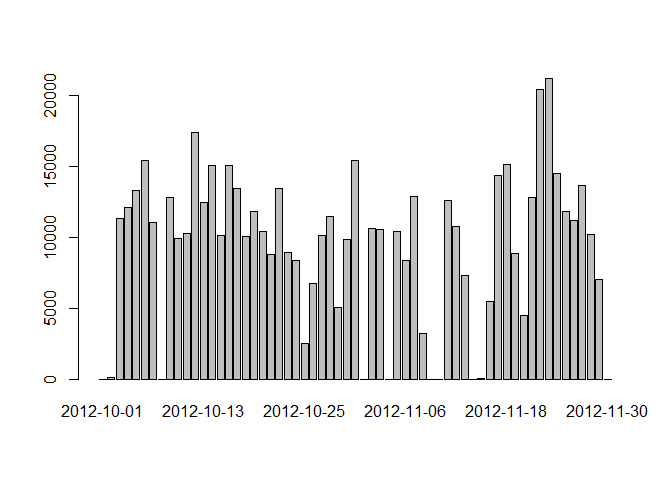

# Reproducible Research: Peer Assessment 1


```r
library(data.table)
# library(tidyr)
library(dplyr)
```
## Loading and preprocessing the data

Extract the activity.cvs file from activity.zip,  
created data.frame from the csv file and wrap the data frame into adata table

```r
library(data.table)
activity <- data.table(read.csv(unz("activity.zip","activity.csv")))
```

## What is mean total number of steps taken per day?

Group the data by day, and summerize the steps by date. 
For dates that do not have steps, the number of steps is set to zero

```r
library(dplyr)
number.of.steps.by.day <- activity %>% group_by(date) %>% summarise_each(funs(sum(., na.rm = TRUE)), steps)
```

To create a histogram on a day basis, the precentage steps per day relative to the total number of steps has to be calculated, 

```r
total.number.of.steps <-sum(activity$steps, na.rm = TRUE)
number.of.steps.by.day <- mutate(number.of.steps.by.day, percentage = steps / total.number.of.steps * 100)
```


```r
# plot( number.of.steps.by.day$date, number.of.steps.by.day$percentage, type="h")
barplot( number.of.steps.by.day$percentage, names.arg=number.of.steps.by.day$date)
```

 

## What is the average daily activity pattern?


## Imputing missing values


## Are there differences in activity patterns between weekdays and weekends?
